# Node_Team_Profile_Generator
This Repository contains code that will generate a summary of each member in a Business/Organization.

# Description

This Repository houses several folders and files, each with their own specific roles. The main file is the index.js file which when invoked using the command line, will prompt the user to enter various information that will then be saved. These saved inputs will then be used by the makeHTML file to dynamically create a webpage that outputs the users inputs. The lib folder has 4 files based on the roles of the each member in the Business/organization. These files are constructors for the prompts and tests that will be used within the index,js and makeHTML.js.

# Images

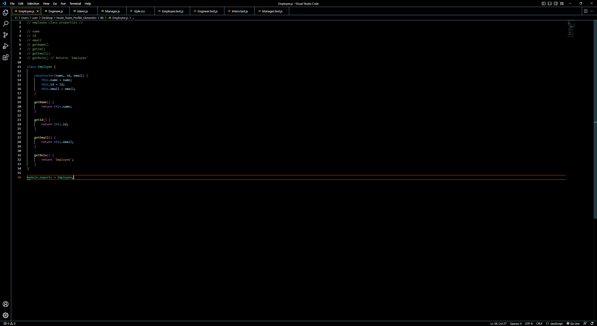
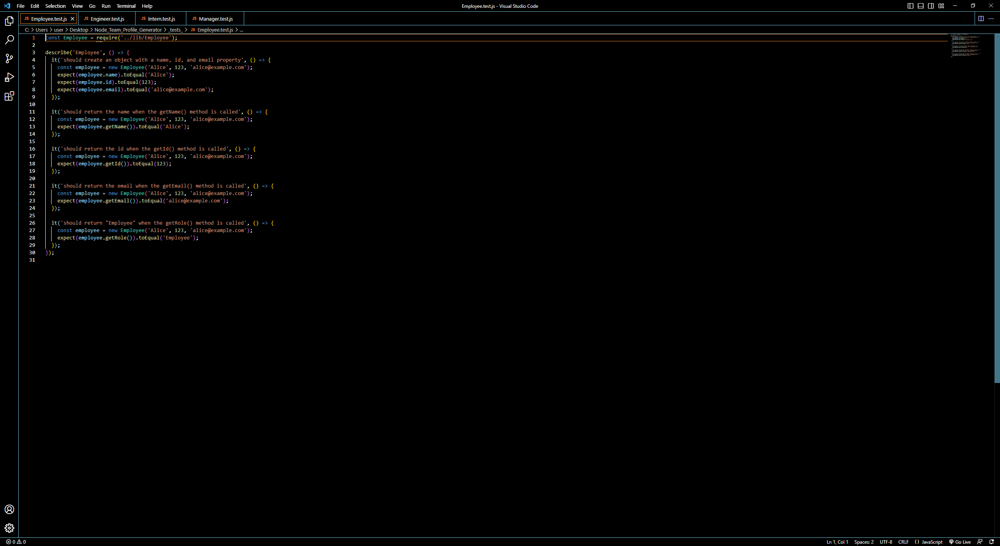
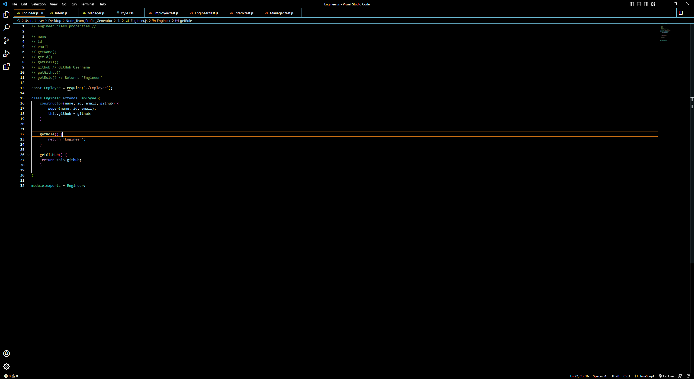
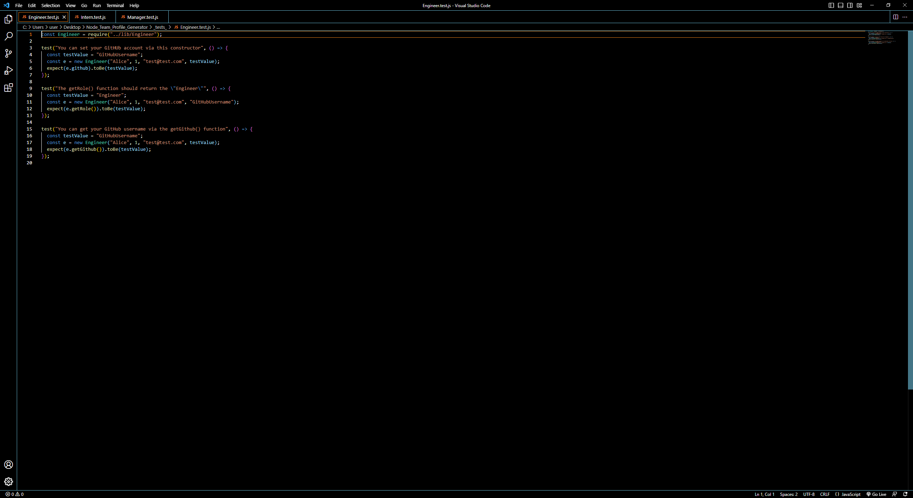
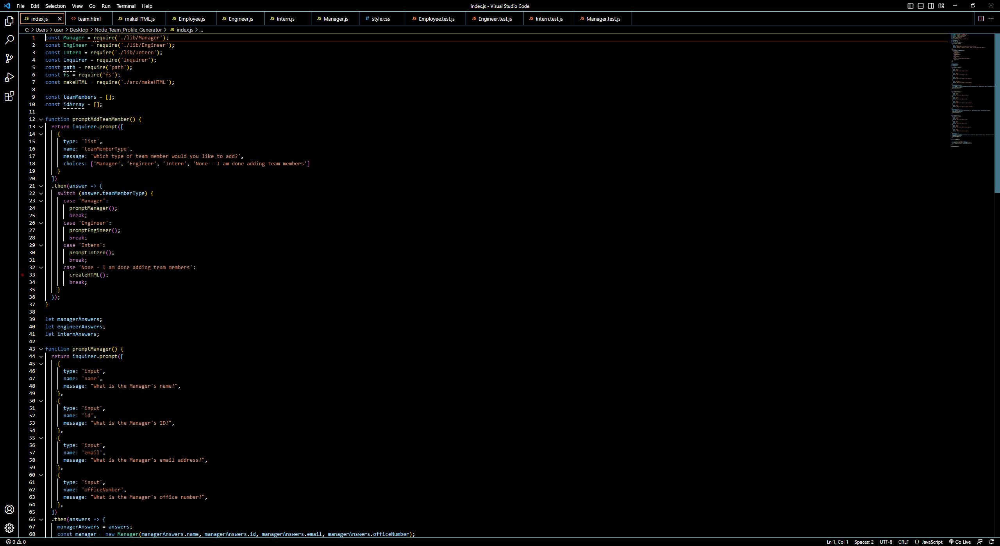
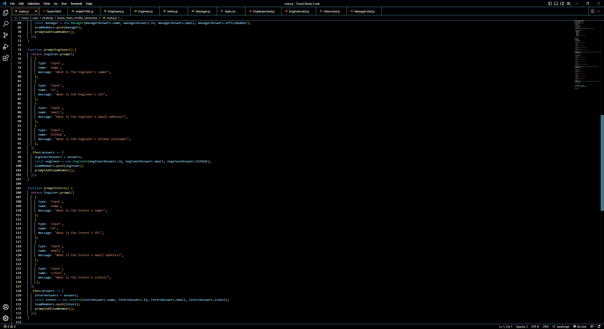
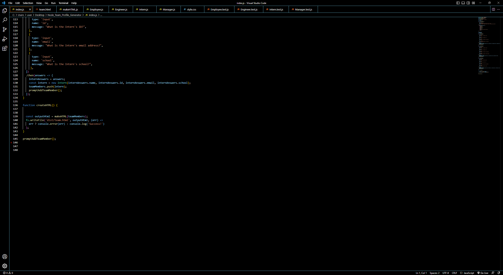
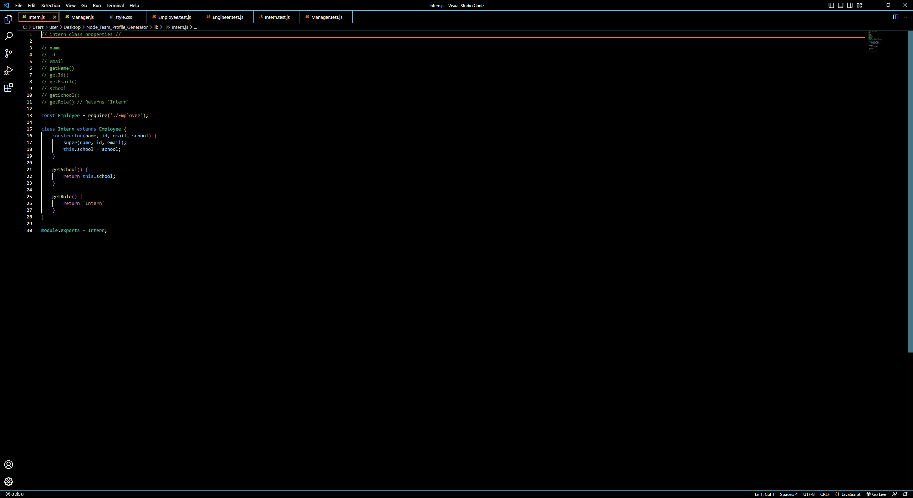
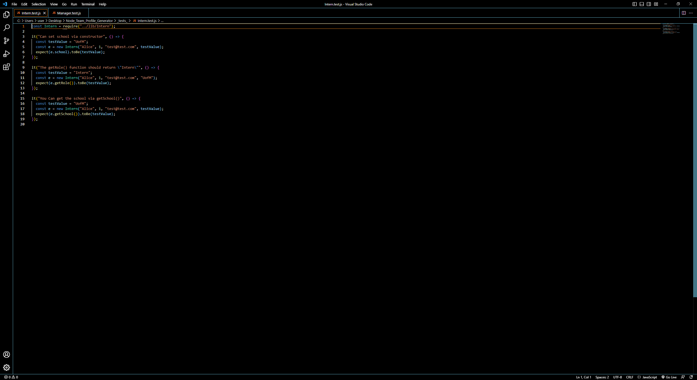
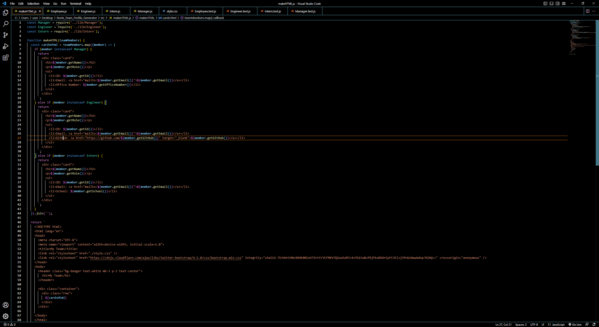
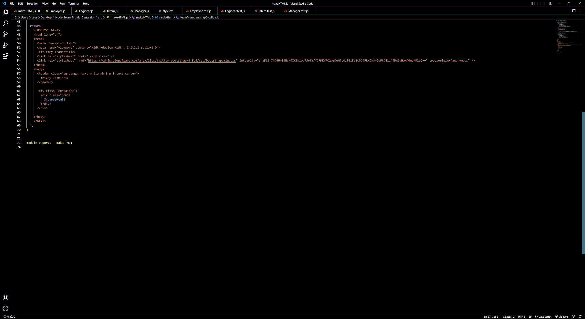
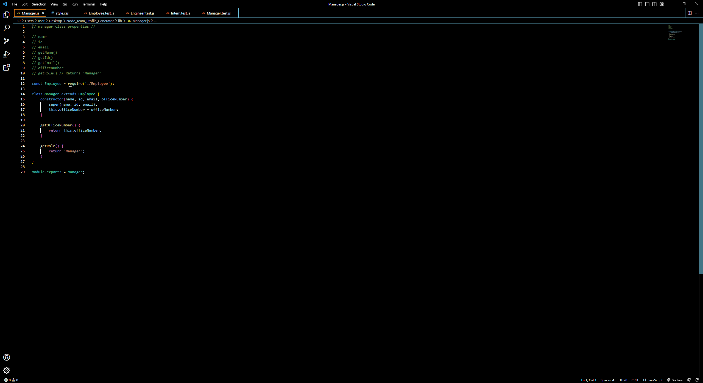
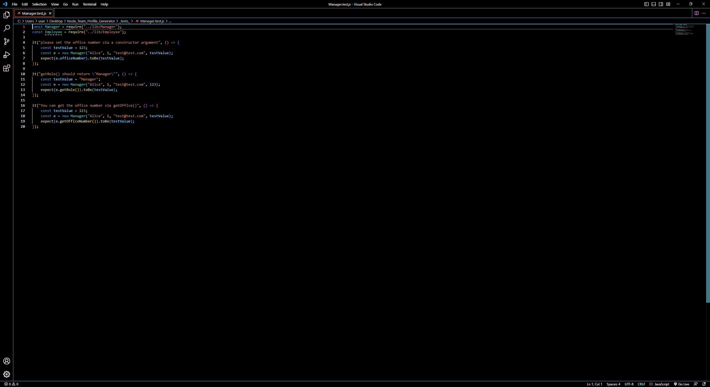
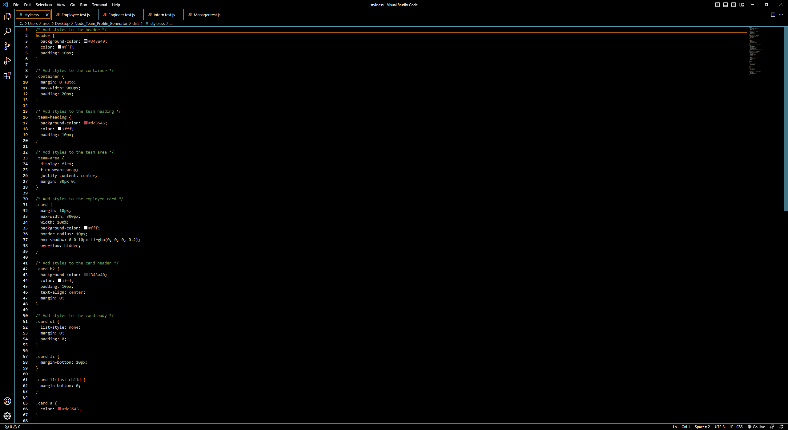
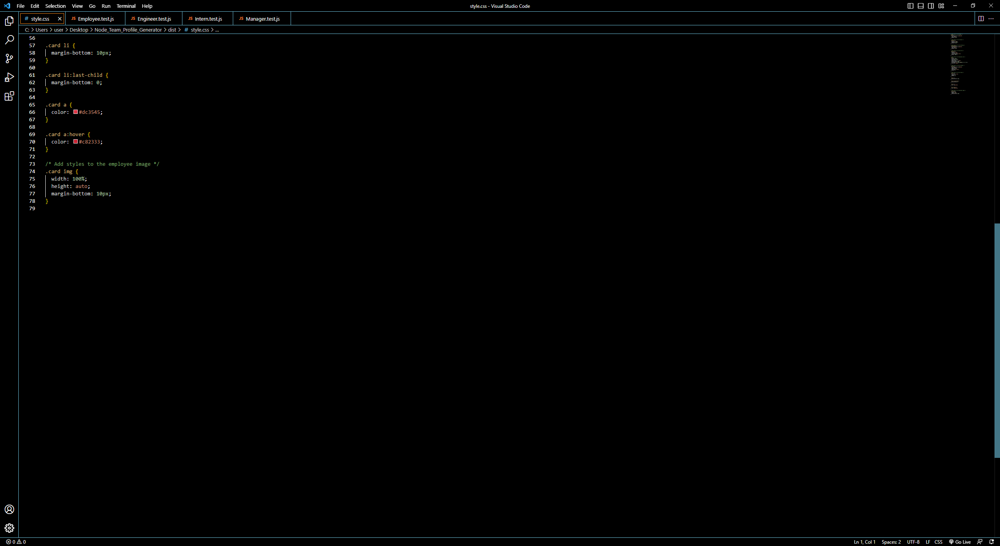
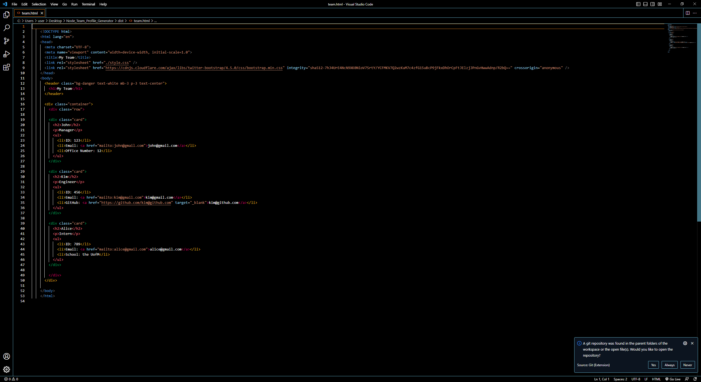
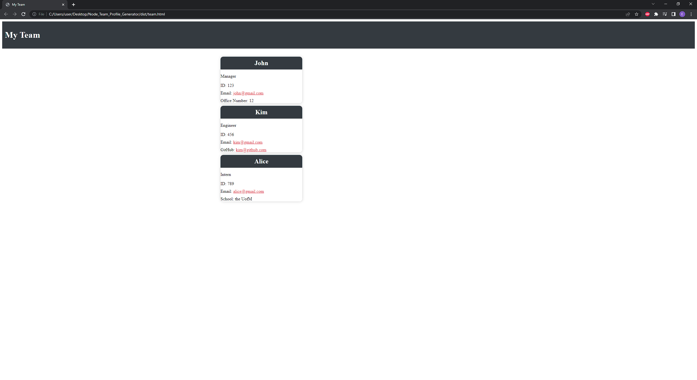

# Links 

Walkthrough Video : https://drive.google.com/file/d/1pafellMrpqZrtWSDleMLnNEh5Rs_kEv1/view

Github Repo : https://github.com/Ervin543/Node_Team_Profile_Generator

Sample HTML File : https://drive.google.com/file/d/1sI9METZasPZkpDhX6y6GznQQt-jwbHju/view?usp=sharing

